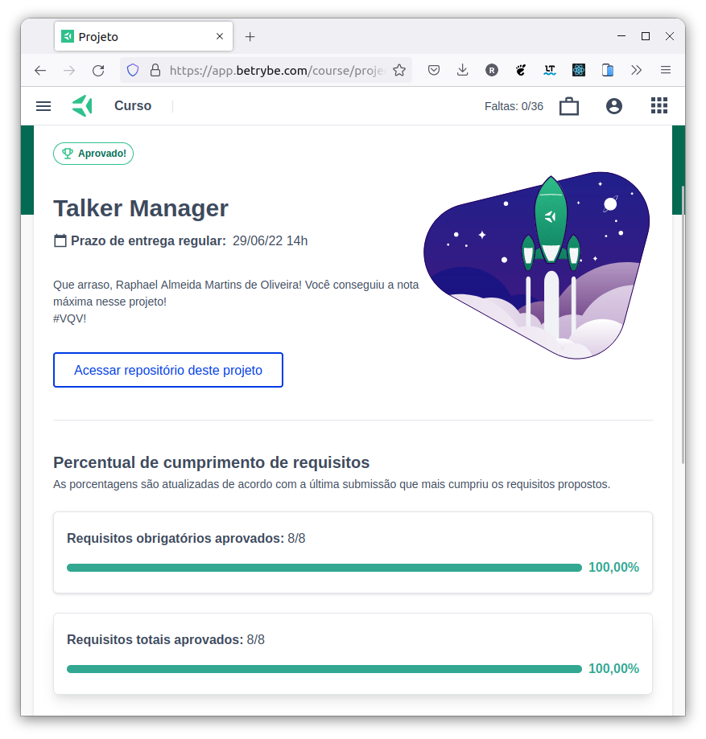

# :microphone: Talker Manager :microphone:

## :page_with_curl: About/Sobre

  
<strong>:us: English</strong>
 

Node.js and Express.js project developed by [Raphael Martins](https://www.linkedin.com/in/raphaelameidamartins/) at the end of Unit 22 ([Back-end Development Module](https://github.com/raphaelalmeidamartins/trybe_exercicios/tree/main/3_Desenvolvimento-Back-end)) of Trybe's Web Development course. I was approved with 100% of the mandatory and optional requirements met.

We had to develop an Express aplication using middlewares.
 

  
<strong>:brazil: Português</strong>
 

Projeto Node.js e Express.js desenvolvido por [Raphael Martins](https://www.linkedin.com/in/raphaelameidamartins/) ao final do Bloco 22 ([Módulo Desenvolvimento Back-end](https://github.com/raphaelalmeidamartins/trybe_exercicios/tree/main/3_Desenvolvimento-Back-end)) do curso de Desenvolvimento Web da Trybe. Fui aprovado com 100% dos requisitos obrigatórios e opcionais atingidos.

Tivemos que desenvolver uma aplicação Express usando middlewares.
 

## :man_technologist: Developed Skills/Habilidades Desenvolvidas

  
<strong>:us: English</strong>
 

* Create a Express.js application
* Create routes
* Apply middlewares
* Use Node.js native modules
 

  
<strong>:brazil: Português</strong>
 

* Criar uma aplicação Express.js
* Criar Rotas
* Aplicar middlewares
* Usar módulos nativos do Node.js
 

## :hammer_and_wrench: Tools/Ferramentas

* Node.js
* Express.js
* Body Parser
* Docker

## :trophy: Grade/Nota

